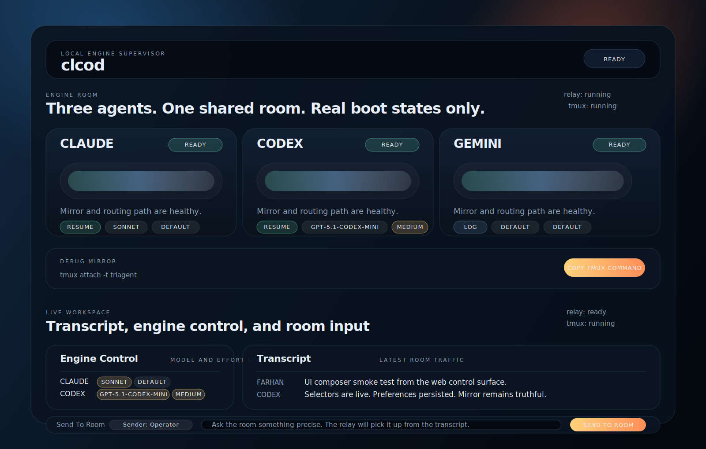
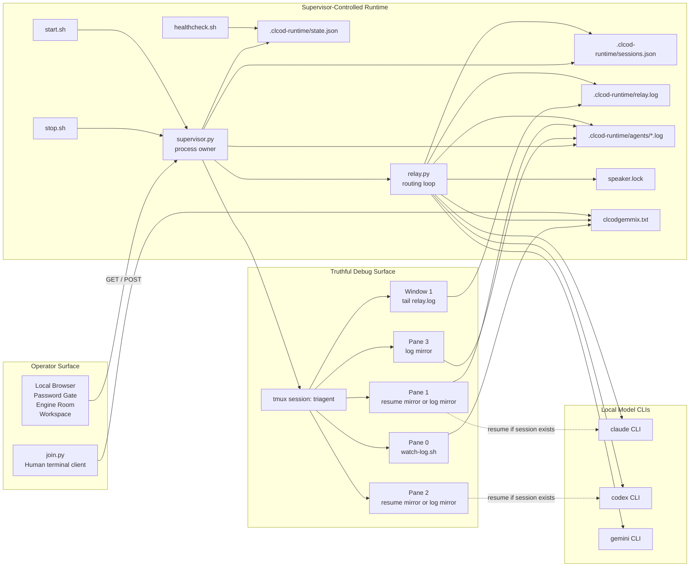
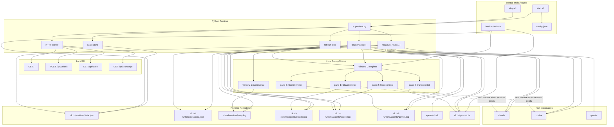
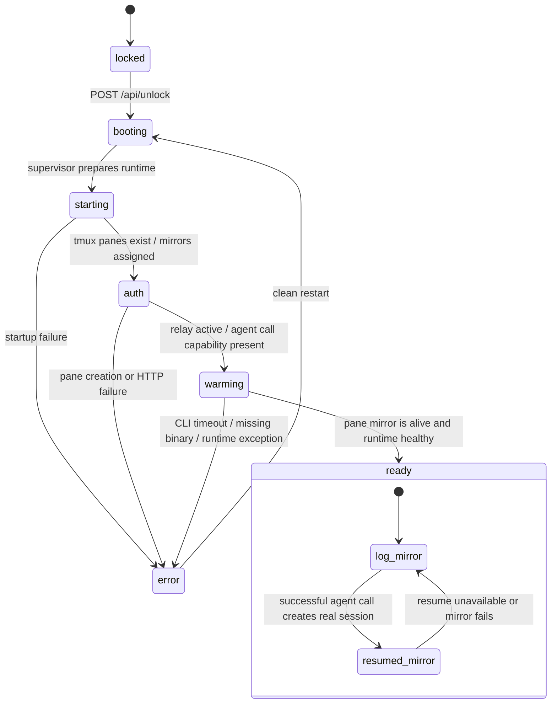
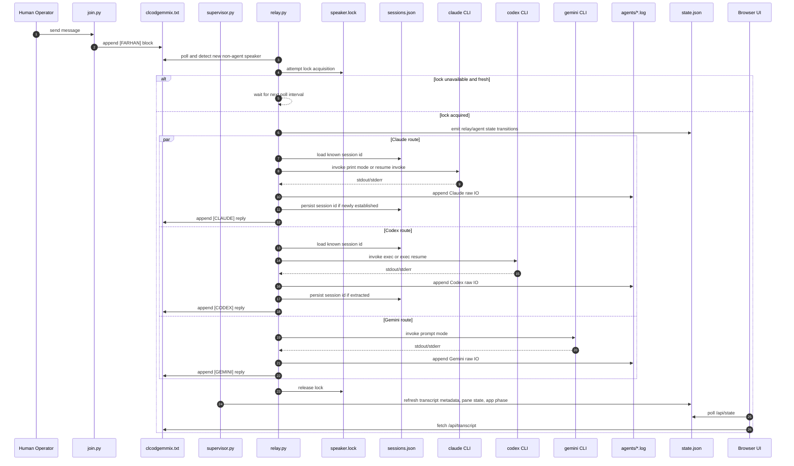
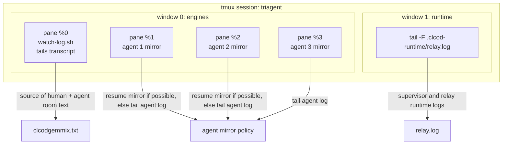

# clcod

`clcod` is a local-first multi-agent workspace that keeps Claude, Codex, Gemini, and a human operator inside one shared transcript while exposing an app-style control surface, real runtime state, and a truthful tmux debug mirror.

## Dashboard Snapshot

The current local dashboard is shown below. This snapshot reflects the engine-room control deck, live transcript panel, and the in-app room composer introduced in the latest update.



The current architecture is intentionally split into two surfaces:

- The local web app is the primary operator UI.
- The tmux room is a mirror and debug surface created by the supervisor.

That distinction matters. The system of record is no longer "whatever happens to be visible in tmux". The system of record is the supervisor runtime state plus the shared transcript.

## Core idea

Three model CLIs and one human share one append-only room log:

- Humans write into `clcodgemmix.txt` with `join.py`.
- The relay watches for new non-agent messages.
- Enabled agents are invoked non-interactively.
- Replies are appended back into the same transcript.
- The supervisor owns tmux mirrors, runtime state, and the local UI server.

The result is one room with memory, rather than three unrelated chats.

## What changed in this version

The previous version was tmux-first. It launched interactive panes and separately launched relay subprocesses. That produced a false surface: the pane often showed a fresh chat that was not the real subprocess handling the room message.

This version fixes that directionally:

- `supervisor.py` owns the runtime lifecycle.
- `relay.py` owns the non-interactive agent calls and session persistence.
- `.clcod-runtime/state.json` is the live status contract for the UI.
- tmux is built by the supervisor as a mirror/debug workspace.
- Resume panes are only used when a real session actually exists.
- Cold boot stays honest: agents start in log-mirror mode until they have a real resumable session.

## Requirements

- macOS or Linux
- `python3` 3.9+
- `tmux` 3.0+
- authenticated local CLIs for any enabled models:
  - `claude`
  - `codex`
  - `gemini`

No model SDK is used from Python. The supervisor calls the installed CLIs directly.

## Quick start

Start the system:

```bash
bash start.sh
```

Open the UI:

```bash
http://127.0.0.1:4173
```

Default local password:

```text
free
```

Override it:

```bash
export CLCOD_PASSWORD='your-password'
bash start.sh
```

Attach to the debug room:

```bash
tmux attach -t triagent
```

Join the room from another terminal:

```bash
python3 join.py --config ./config.json --name Farhan
```

Check health:

```bash
bash healthcheck.sh
```

Stop everything:

```bash
bash stop.sh
```

## High-level architecture



## Detailed control-plane architecture

This diagram shows the actual ownership model in more detail.



## Boot flow and engine-state semantics

The UI does not use fake timers. The "engine room" should reflect backend truth.



## Detailed message routing sequence

This is the core room behavior when a human posts a new message.



## tmux layout

The supervisor creates tmux strictly as a mirror/debug surface.



Important consequences:

- A pane must never imply a live session that does not actually exist.
- Pane targets are stored as stable tmux pane IDs, not numeric indexes.
- `remain-on-exit` is enabled so a failed mirror cannot silently collapse the layout.
- Cold boot uses log mirrors until real resumable sessions are available.

## Runtime artifacts

The supervisor writes and consumes these files:

| Path | Purpose |
|------|---------|
| `clcodgemmix.txt` | shared append-only room transcript |
| `speaker.lock` | room-wide relay lock |
| `.clcod-runtime/state.json` | UI and health surface runtime contract |
| `.clcod-runtime/sessions.json` | persisted per-agent resumable session IDs |
| `.clcod-runtime/relay.log` | supervisor and relay operational log |
| `.clcod-runtime/agents/claude.log` | Claude raw IO mirror source |
| `.clcod-runtime/agents/codex.log` | Codex raw IO mirror source |
| `.clcod-runtime/agents/gemini.log` | Gemini raw IO mirror source |

## API surface

The local HTTP server lives inside `supervisor.py`.

### `GET /`

Serves the local app shell.

### `POST /api/unlock`

Payload:

```json
{
  "password": "free"
}
```

Effect:

- validates the local password
- creates an HTTP-only session cookie
- returns the current runtime snapshot

### `GET /api/state`

Before unlock:

```json
{
  "locked": true,
  "app": {
    "phase": "locked"
  }
}
```

After unlock:

- full runtime state
- app phase
- relay state
- tmux state
- per-agent mirror mode, mirror view, pane target, session ID, last error, last reply time

### `GET /api/transcript?limit=N`

Returns recent tagged transcript entries for the workspace view.

## Configuration reference

`config.json` is the runtime source of truth.

### Current shape

```json
{
  "agents": [
    {
      "name": "CLAUDE",
      "enabled": true,
      "cmd": "claude",
      "args": ["-p"],
      "invoke_resume_args": ["-p", "--session-id", "{session_id}"],
      "mirror_resume_args": ["--resume", "{session_id}"],
      "mirror_mode": "resume",
      "preseed_session_id": true,
      "timeout": 60
    },
    {
      "name": "CODEX",
      "enabled": true,
      "cmd": "codex",
      "args": [
        "exec",
        "--skip-git-repo-check",
        "--dangerously-bypass-approvals-and-sandbox",
        "-C",
        "{script_dir}"
      ],
      "invoke_resume_args": ["exec", "resume", "{session_id}"],
      "mirror_resume_args": ["resume", "--no-alt-screen", "-C", "{script_dir}", "{session_id}"],
      "mirror_mode": "resume",
      "preseed_session_id": false,
      "timeout": 60
    },
    {
      "name": "GEMINI",
      "enabled": true,
      "cmd": "gemini",
      "args": ["-p"],
      "mirror_mode": "log",
      "preseed_session_id": false,
      "timeout": 60
    }
  ],
  "workspace": {
    "log_path": "clcodgemmix.txt",
    "lock_path": "speaker.lock",
    "poll_sec": 0.5,
    "context_len": 6000,
    "relay_log_path": ".clcod-runtime/relay.log",
    "pid_path": ".clcod-runtime/supervisor.pid",
    "state_path": ".clcod-runtime/state.json",
    "sessions_path": ".clcod-runtime/sessions.json",
    "agent_logs_dir": ".clcod-runtime/agents"
  },
  "locks": {
    "ttl": 90
  },
  "tmux": {
    "session": "triagent"
  },
  "ui": {
    "host": "127.0.0.1",
    "port": 4173,
    "password_env": "CLCOD_PASSWORD",
    "password": "free",
    "open_browser": true
  }
}
```

### Semantics

#### `agents[].args`

Base non-interactive invocation arguments used before a resumable session exists.

#### `agents[].invoke_resume_args`

Arguments used by the relay when a real session ID is known and the agent supports resumed non-interactive invocation.

#### `agents[].mirror_resume_args`

Arguments used by the supervisor when the tmux pane should attach to the actual agent session instead of tailing a log.

#### `agents[].mirror_mode`

- `resume`: prefer a real resumed pane when safe and available
- `log`: always use log tailing

#### `agents[].preseed_session_id`

Controls whether the invoke path may create a deterministic session identifier for the first successful relay call. Boot-time tmux mirrors do not trust this value by itself.

#### `workspace.state_path`

The file the UI and `healthcheck.sh` read as the live runtime contract.

## File layout

| File | Purpose |
|------|---------|
| `start.sh` | boot entrypoint |
| `stop.sh` | shutdown entrypoint |
| `healthcheck.sh` | runtime health and stale-state reporting |
| `supervisor.py` | process owner, HTTP server, tmux manager, state writer |
| `relay.py` | transcript watcher and agent router |
| `join.py` | human CLI client |
| `watch-log.sh` | transcript tail helper used in tmux |
| `web/index.html` | local app shell |
| `web/app.js` | UI state polling, unlock flow, rendering |
| `web/styles.css` | engine-room visual language and animations |
| `tests/test_relay.py` | relay unit tests |
| `tests/test_supervisor.py` | supervisor unit tests |

## Health model

`healthcheck.sh` reports:

- supervisor PID presence and liveness
- stale lock detection
- transcript presence
- runtime state freshness
- app phase
- relay state
- per-agent state, mirror view, and pane target
- tmux session presence

Expected healthy output characteristics:

- app phase is `ready`
- relay state is `running`
- tmux session exists
- each enabled agent has a pane target
- `state.json` age is recent

## Verification

Static checks:

```bash
python3 -m py_compile relay.py supervisor.py join.py
bash -n start.sh stop.sh healthcheck.sh
```

Unit tests:

```bash
python3 -m unittest discover -s tests
```

Suggested manual smoke:

1. Run `bash start.sh`.
2. Open `http://127.0.0.1:4173`.
3. Unlock with `CLCOD_PASSWORD` or the configured fallback password.
4. Confirm `/api/state` shows `app.phase = ready`.
5. Confirm tmux exists with `tmux attach -t triagent`.
6. Post a human message with `join.py`.
7. Confirm enabled agents append replies into `clcodgemmix.txt`.
8. Confirm `.clcod-runtime/agents/*.log` update.
9. Confirm `bash healthcheck.sh` stays green.
10. Run `bash stop.sh`.

## Operational notes

- The browser UI is local-only convenience access control, not production authentication.
- The transcript remains the room's canonical conversational history.
- The tmux surface is for observability and debugging, not the source of truth.
- Resume mirrors are opportunistic. If an agent cannot safely resume, the system falls back to a log mirror.
- This repo still contains older artifacts such as `agent.py` and `shared-room/`; the active path is the supervisor + relay + web UI stack.

## Troubleshooting

### The app does not open

- Check `bash healthcheck.sh`.
- Check `.clcod-runtime/relay.log`.
- Verify nothing else is listening on the configured UI port.

### The UI is up but shows `locked`

- Call `POST /api/unlock` by using the form in the browser.
- Confirm `CLCOD_PASSWORD` matches what you expect.

### tmux exists but panes look wrong

- Check `state.json` pane targets and mirror views.
- Confirm the engine window has four panes: transcript plus three agent panes.
- Confirm failed mirrors are not being mistaken for live resumed sessions.

### Agents are not replying

- Check each agent binary is installed and authenticated.
- Inspect `.clcod-runtime/agents/*.log`.
- Inspect `.clcod-runtime/relay.log`.
- Disable failing agents in `config.json` and retry.

### A pane should be resumed but is still a log mirror

- That means no real session has been established yet, or resume failed and the supervisor fell back to the truthful mirror.
- Send a real room prompt first so the relay can create and persist the session.

## License

This project is licensed under the MIT License. See [LICENSE](/Users/moofasa/clcod/LICENSE).
