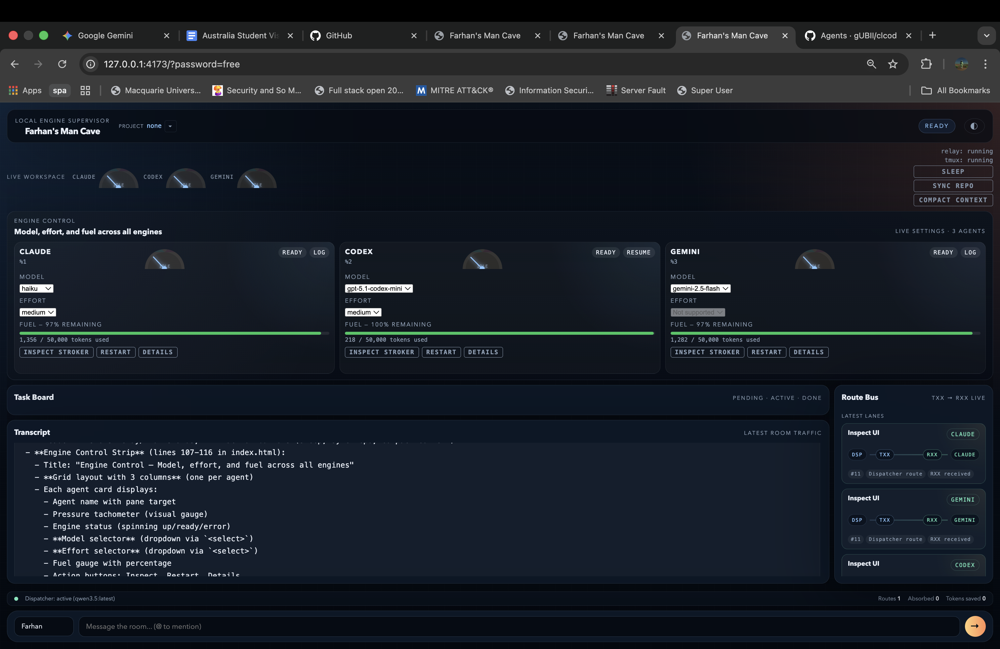
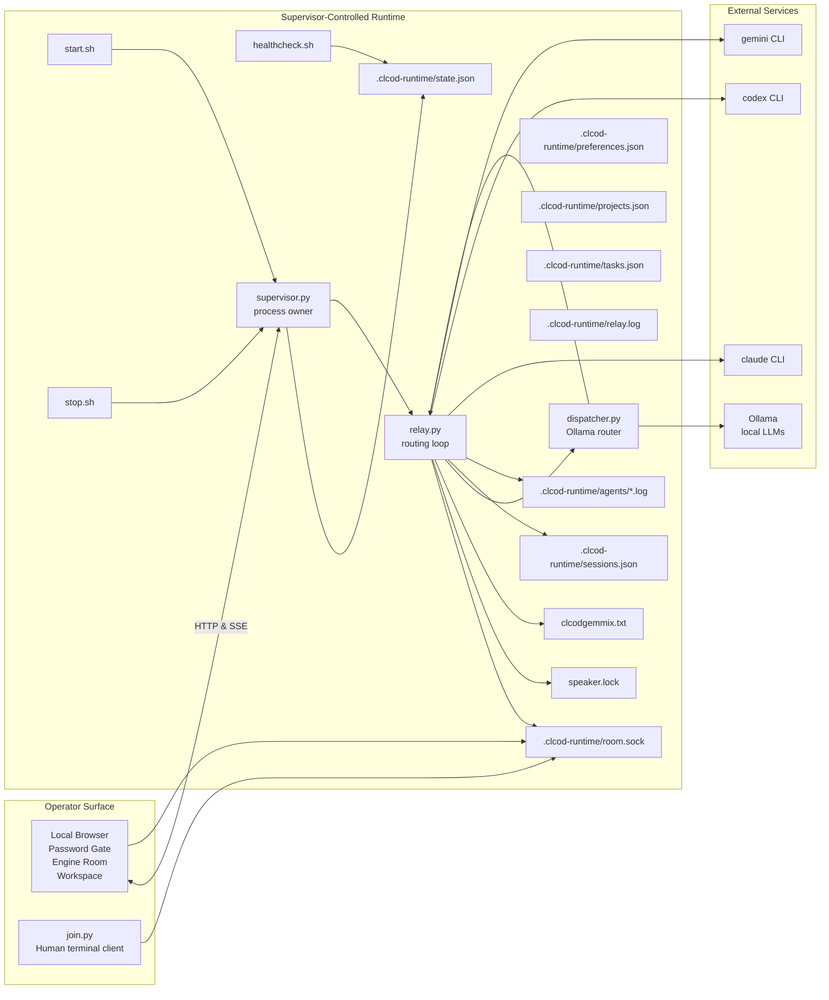
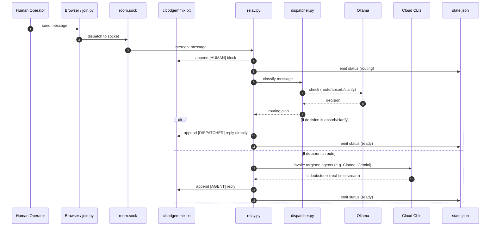
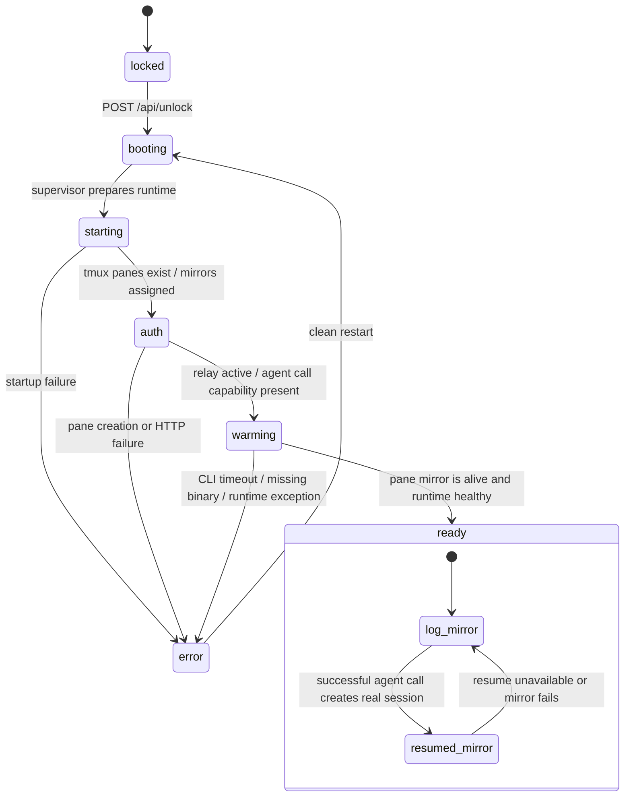
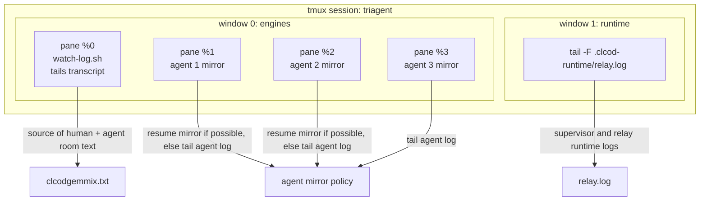

# clcod

`clcod` is a local-first multi-agent workspace that keeps Claude, Codex, Gemini, and a human operator inside one shared transcript while exposing an app-style control surface, real runtime state, and a truthful tmux debug mirror. The system relies on a local Ollama-powered routing layer (`dispatcher.py`) to triage, route, or absorb messages before passing them to cloud agents.

## Dashboard Snapshot

The current local dashboard is shown below. This is the live browser view of the operator surface, including the engine control strip, per-agent model and effort controls, the task board, transcript stream, route bus, and room composer.



The current architecture is intentionally split into two surfaces:

- The local web app is the primary operator UI.
- The tmux room is a mirror and debug surface created by the supervisor.

That distinction matters. The system of record is no longer "whatever happens to be visible in tmux". The system of record is the supervisor runtime state plus the shared transcript.

## Core idea

Three model CLIs and one human share one append-only room log:

- Humans write into `clcodgemmix.txt` with `join.py` or via the web UI.
- The relay watches for new non-agent messages.
- Messages run through a local `dispatcher.py` (powered by Ollama) which decides to route to specific cloud agents, ask clarifying questions, or absorb the message locally.
- Enabled agents are invoked non-interactively.
- Replies are appended back into the same transcript.
- The supervisor owns tmux mirrors, runtime state, and the local UI server.

The result is one room with memory, rather than three unrelated chats.

## What changed in this version

The system has evolved significantly from a simple tmux script into a full local runtime:

- **Dispatcher layer:** Local Ollama-powered routing (absorb, route, clarify).
- **Task system:** Built-in task tracking with `/task`, `/move`, `/moveall`, `/clearall` commands, persisted in `tasks.json`, with batch processing.
- **Project locking:** Support for isolating workspaces per project (`projects.json`), securely injecting the `work_dir` for each agent.
- **SSE event stream:** Replaced UI polling with a low-latency Server-Sent Events (SSE) `/api/events` endpoint.
- **Model & effort selectors:** Per-agent dynamic model and reasoning effort settings, persisting across restarts in `preferences.json`.
- **Sleep & wake toggle:** Suspend routing traffic selectively without tearing down the runtime.
- **Expanded API surface:** Extensible GET/POST operations for deep UI integration.

## Requirements

- macOS or Linux
- `python3` 3.9+
- `tmux` 3.0+
- Ollama (Optional, but required if `dispatcher.enabled` is `true` in config).
- Authenticated local CLIs for any enabled models:
  - `claude` (default 180s timeout)
  - `codex` (default 180s timeout)
  - `gemini` (default 120s timeout, requires `-y -p` args for YOLO prompt mode)

No model SDK is used from Python. The supervisor calls the installed CLIs directly.

## Quick start

Start the system:

```bash
bash start.sh
```

Open the UI:

```
http://127.0.0.1:4173
```

Default local password:

```
free
```

Override it:

```bash
export CLCOD_PASSWORD='your-password'
bash start.sh
```

Attach to the debug room:

```bash
tmux attach -t triagent
```

Join the room from another terminal:

```bash
python3 join.py --config ./config.json --name Farhan
```

Check health:

```bash
bash healthcheck.sh
```

Stop everything:

```bash
bash stop.sh
```

## High-level architecture



## Detailed message routing sequence

This is the core room behavior when a human posts a new message.



## Boot flow and engine-state semantics

The UI phases map directly to backend state. The "engine room" reflects backend truth — no fake timers.



## tmux layout

The supervisor creates tmux strictly as a mirror/debug surface.



Important consequences:

- A pane must never imply a live session that does not actually exist.
- Pane targets are stored as stable tmux pane IDs, not numeric indexes.
- `remain-on-exit` is enabled so a failed mirror cannot silently collapse the layout.
- Cold boot uses log mirrors until real resumable sessions are available.

## Runtime artifacts

The supervisor writes and consumes these files:

| Path | Purpose |
|------|---------|
| `clcodgemmix.txt` | shared append-only room transcript |
| `speaker.lock` | room-wide relay lock |
| `.clcod-runtime/state.json` | UI and health surface runtime contract |
| `.clcod-runtime/sessions.json` | persisted per-agent resumable session IDs |
| `.clcod-runtime/room.sock` | Unix socket for IPC chat dispatch |
| `.clcod-runtime/preferences.json` | Persisted per-agent model/effort selections |
| `.clcod-runtime/projects.json` | Project bookmarks and active project lock |
| `.clcod-runtime/tasks.json` | Task tracking (pending / in_progress / done) |
| `.clcod-runtime/relay.log` | supervisor and relay operational log |
| `.clcod-runtime/agents/*.log` | Agent raw IO mirror sources |

## API surface

The local HTTP server lives inside `supervisor.py`.

### GET endpoints
- `GET /` - Serves the local app shell.
- `GET /api/state` - Full runtime state, including UI config, sleep state, tmux attach info, per-agent configs (fuel, effort, models), projects, tasks, and transcript revisions.
- `GET /api/transcript?limit=N` - Returns recent tagged transcript entries.
- `GET /api/events` - SSE endpoint streaming real-time JSON updates.
- `GET /api/projects` - List bookmarked projects and the active project.
- `GET /api/tasks?status=<filter>` - Fetch tasks (filtered by pending, in_progress, or done).
- `GET /api/dispatcher/health` - Check Ollama availability and routing token usage/stats.
- `GET /api/agents/<name>/logs?tail=N` - Fetch the last N lines of a specific agent's raw IO log.

### POST endpoints
- `POST /api/unlock` - Validates the local password.
- `POST /api/chat` - Submit a message body and sender name. Emits to the socket for routing.
- `POST /api/agents/<name>/settings` - Update `selected_model` and `selected_effort`, writes to `preferences.json`.
- `POST /api/agents/<name>/restart` - Kills and gracefully resuscitates an agent mirror pane.
- `POST /api/compact` - Flushes old logs and uses the dispatcher (or cloud fallback) to write a summary to the top of the transcript.
- `POST /api/repo/pull` - Executes git pull, validates repo structure, sets permissions, and emits a `SYSTEM` broadcast to agents.
- `POST /api/sleep` - Toggle global routing sleep (`{"sleep": true/false}`).
- `POST /api/projects/lock` - Lock the context to a local path or git URL.
- `POST /api/projects/unlock` - Unlock the workspace context.
- `POST /api/tasks` - Create a new task.
- `POST /api/tasks/<id>` - Modify a task's status, assignment, or priority.

## SSE Events

The `/api/events` endpoint provides a Server-Sent Events stream:

| Event | Payload fields | When emitted |
|-------|----------------|--------------|
| `init` | full state snapshot | on connection |
| `state_refresh` | full state snapshot | every ~3s |
| `relay_state` | `state` | relay start/stop |
| `agent_state` | `agent`, `state`, `session_id`, `last_error`, `tokens_delta` | per-agent state change |
| `transcript` | `last_speaker`, `rev`, `message` (optional) | on new message append |
| `dispatcher` | `action`, `targets`, `task_type`, `priority` | per routing decision |
| `task_created` | `task` | on `/task` command |
| `task_updated` | `task` | on `/move` or status change |
| `tasks_updated`| `tasks`, `new_status` | on `/moveall` or batch |
| `tasks_cleared`| — | on `/clearall` |

## Room commands

Certain message prefixes allow the human operator to control tasks and dispatch logic via chat:

| Prefix | Effect |
|--------|--------|
| `/task <title>` | Create a task; the dispatcher evaluates and assigns it |
| `/task @AGENT <title>` | Create a task AND force-route it to a specific agent (e.g. `/task @CODEX audit the relay`) |
| `/move #<id> <status>` | Update a specific task status (pending/in_progress/done) |
| `/moveall <status>` | Bulk-move all active tasks to a new status |
| `/clearall` | Delete all tasks and reset task IDs |
| `@CLAUDE`, `@CODEX`, `@GEMINI` | Bypass the dispatcher and force-route the message directly to the targeted agent(s) |

When a `/task` message is routed, agents receive a structured task prompt instead of the normal conversational prompt. The task prompt includes the task ID, title, full request text, and working directory, with explicit instructions to inspect code and act — not narrate. Batch-pending tasks (auto-dispatched every 30s) also use this structured prompt.

## Configuration reference

`config.json` is the runtime source of truth.

### Current shape

```json
{
  "agents": [
    {
      "name": "CLAUDE",
      "enabled": true,
      "cmd": "claude",
      "args": [
        "-p",
        "--dangerously-skip-permissions"
      ],
      "invoke_resume_args": [
        "-p",
        "--dangerously-skip-permissions",
        "--session-id",
        "{session_id}"
      ],
      "mirror_resume_args": [
        "--resume",
        "{session_id}"
      ],
      "model_arg": [
        "--model",
        "{value}"
      ],
      "effort_arg": [
        "--effort",
        "{value}"
      ],
      "model_options": [
        "default",
        "haiku",
        "sonnet",
        "opus"
      ],
      "effort_options": [
        "default",
        "low",
        "medium",
        "high",
        "max"
      ],
      "mirror_mode": "log",
      "preseed_session_id": true,
      "timeout": 180
    },
    {
      "name": "CODEX",
      "enabled": true,
      "cmd": "codex",
      "args": [
        "exec",
        "--skip-git-repo-check",
        "--dangerously-bypass-approvals-and-sandbox",
        "-C",
        "{script_dir}"
      ],
      "invoke_resume_args": [
        "exec",
        "resume",
        "{session_id}"
      ],
      "mirror_resume_args": [
        "resume",
        "--dangerously-bypass-approvals-and-sandbox",
        "--no-alt-screen",
        "-C",
        "{script_dir}",
        "{session_id}"
      ],
      "model_arg": [
        "-m",
        "{value}"
      ],
      "effort_arg": [
        "-c",
        "model_reasoning_effort=\"{value}\""
      ],
      "mirror_mode": "resume",
      "preseed_session_id": false,
      "selected_effort": "medium",
      "timeout": 180
    },
    {
      "name": "GEMINI",
      "enabled": true,
      "cmd": "gemini",
      "args": [
        "-y",
        "-p"
      ],
      "model_arg": [
        "--model",
        "{value}"
      ],
      "model_options": [
        "default",
        "gemini-2.5-pro",
        "gemini-2.5-flash",
        "gemini-2.0-flash"
      ],
      "mirror_mode": "log",
      "preseed_session_id": false,
      "timeout": 120
    }
  ],
  "workspace": {
    "log_path": "clcodgemmix.txt",
    "lock_path": "speaker.lock",
    "socket_path": ".clcod-runtime/room.sock",
    "poll_sec": 0.5,
    "context_len": 6000,
    "relay_log_path": ".clcod-runtime/relay.log",
    "pid_path": ".clcod-runtime/supervisor.pid",
    "state_path": ".clcod-runtime/state.json",
    "sessions_path": ".clcod-runtime/sessions.json",
    "preferences_path": ".clcod-runtime/preferences.json",
    "agent_logs_dir": ".clcod-runtime/agents",
    "projects_path": ".clcod-runtime/projects.json",
    "tasks_path": ".clcod-runtime/tasks.json"
  },
  "locks": {
    "ttl": 90
  },
  "tmux": {
    "session": "triagent"
  },
  "ui": {
    "host": "127.0.0.1",
    "port": 4173,
    "password_env": "CLCOD_PASSWORD",
    "password": "free",
    "default_sender": "Operator",
    "open_browser": true
  },
  "dispatcher": {
    "enabled": true,
    "ollama_host": "http://localhost:11434",
    "router_model": "qwen3.5:latest",
    "summarizer_model": "qwen3.5:9b",
    "validator_model": "rnj-1:8b",
    "router_timeout": 15,
    "summarizer_timeout": 30,
    "validator_timeout": 10,
    "fallback_action": "route"
  }
}
```

### Semantics

#### `agents[].args`
Base non-interactive invocation arguments used before a resumable session exists.

#### `agents[].invoke_resume_args`
Arguments used by the relay when a real session ID is known and the agent supports resumed non-interactive invocation.

#### `agents[].mirror_resume_args`
Arguments used by the supervisor when the tmux pane should attach to the actual agent session instead of tailing a log.

#### `agents[].mirror_mode`
- `resume`: prefer a real resumed pane when safe and available
- `log`: always use log tailing (required for agents that lack durable sessions or crash when changing directories, e.g. Claude)

#### `agents[].model_arg`
CLI flag template injected when `selected_model` is not `"default"`. Example: `["--model", "{value}"]` expands to `--model sonnet`.

#### `agents[].effort_arg`
CLI flag template injected when `selected_effort` is not `"default"`. Example: `["--effort", "{value}"]` or `["-c", "model_reasoning_effort=\"{value}\""]` for Codex.

#### `agents[].model_options`
List of model IDs shown in the UI model selector. The first entry should always be `"default"` (uses the CLI's own default model).

#### `agents[].effort_options`
List of effort IDs shown in the UI effort selector. Only applies to agents that support a reasoning effort flag.

#### `agents[].preseed_session_id`
If `true`, the relay may generate a deterministic session ID before the first call to allow tmux mirrors to attach early. Boot-time mirrors do not trust this value until the relay confirms a real session was established.

#### `workspace.socket_path`
Unix domain socket used for IPC between the HTTP server and the relay process. The `/api/chat` endpoint writes messages here; the relay reads them. Falls back to direct transcript append if the socket is unavailable.

#### `workspace.projects_path`
Persists project bookmarks and the active project lock. Used by `/api/projects/lock` and `/api/projects/unlock`.

#### `workspace.tasks_path`
Persists the task board state (task list and auto-incrementing ID counter).

#### `workspace.preferences_path`
Persists per-agent model and effort selections across restarts. Written by `/api/agents/<name>/settings`.

#### `ui.default_sender`
Pre-filled sender name shown in the web UI chat form. Can be overridden per session in the browser.

#### `dispatcher.*`
Configures local Ollama models used for routing, summarization, and validation. If Ollama is unreachable, the dispatcher fails safely and broadcasts to all enabled cloud agents instead (`fallback_action: "route"`).

## File layout

| File | Purpose |
|------|---------|
| `start.sh` | boot entrypoint |
| `stop.sh` | shutdown entrypoint |
| `healthcheck.sh` | runtime health and stale-state reporting |
| `supervisor.py` | process owner, HTTP server, tmux manager, state writer |
| `relay.py` | transcript watcher and agent router |
| `dispatcher.py` | Ollama-powered routing, summarization, and validation |
| `join.py` | human CLI client |
| `watch-log.sh` | transcript tail helper used in tmux |
| `web/index.html` | local app shell |
| `web/app.js` | UI state polling, unlock flow, rendering |
| `web/styles.css` | engine-room visual language and animations |
| `tests/` | automated unit tests |

## Health model

`healthcheck.sh` reports:

- supervisor PID presence and liveness
- stale lock detection
- transcript presence
- runtime state freshness
- app phase
- relay state
- dispatcher availability check (`/api/dispatcher/health`)
- per-agent state, mirror view, and pane target
- agent sleep state

Expected healthy output characteristics:

- app phase is `ready`
- relay state is `running`
- dispatcher shows models loaded
- each enabled agent has a pane target

## Operational notes

- The browser UI is local-only convenience access control, not production authentication.
- The transcript remains the room's canonical conversational history.
- **Ollama is optional.** The dispatcher falls back to routing all agents when unavailable.
- Agent model/effort selections survive restarts via `preferences.json`.
- **Sleep mode** suppresses relay dispatching temporarily without killing any underlying processes.
- Resume mirrors are opportunistic. If an agent cannot safely resume across directory changes (like Claude), its `mirror_mode` is set to `"log"`.

## Verification

Static checks:

```bash
python3 -m py_compile relay.py supervisor.py join.py dispatcher.py
bash -n start.sh stop.sh healthcheck.sh
```

Unit tests:

```bash
python3 -m unittest discover -s tests
```

Suggested manual smoke:

1. Run `bash start.sh`.
2. Open `http://127.0.0.1:4173`.
3. Unlock with `CLCOD_PASSWORD` or the configured fallback password.
4. Confirm `/api/state` shows `app.phase = ready`.
5. Confirm tmux exists with `tmux attach -t triagent`.
6. Post a human message with `join.py` or the web UI chat form.
7. Confirm enabled agents append replies into `clcodgemmix.txt`.
8. Confirm `.clcod-runtime/agents/*.log` update.
9. Confirm `bash healthcheck.sh` stays green.
10. Run `bash stop.sh`.

## Troubleshooting

### The app does not open

- Check `bash healthcheck.sh`.
- Check `.clcod-runtime/relay.log`.
- Verify nothing else is listening on the configured UI port.

### The UI is up but shows `locked`

- Call `POST /api/unlock` by using the form in the browser.
- Confirm `CLCOD_PASSWORD` matches what you expect.

### tmux exists but panes look wrong

- Check `state.json` pane targets and mirror views.
- Confirm the engine window has four panes: transcript plus three agent panes.
- Confirm failed mirrors are not being mistaken for live resumed sessions.

### Agents are not replying

- Check each agent binary is installed and authenticated.
- Inspect `.clcod-runtime/agents/*.log`.
- Inspect `.clcod-runtime/relay.log`.
- Disable failing agents in `config.json` and retry.
- If Ollama is down and `dispatcher.enabled` is `true`, check `/api/dispatcher/health`.

### A pane should be resumed but is still a log mirror

- That means no real session has been established yet, or resume failed and the supervisor fell back to the truthful mirror.
- Send a real room prompt first so the relay can create and persist the session.
- Check `agents[].mirror_mode` in `config.json` — some agents (e.g. Claude) are intentionally set to `"log"` mode.

## License

This project is licensed under the MIT License. See [LICENSE](/Users/moofasa/clcod/LICENSE).
